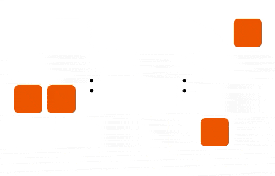

# Binary Clock React Component
Just a simple binary clock component. 

## Example


## Installation
```
npm i binary-clock-react
```

## Usage
```
import { BinaryClock } from "binary-clock-react";

<BinaryClock />
```

## Customization
```
{
    // this will be used to color the bulb when it is on
    primaryColor: "#000000",
    // this will be used to color the bulb when it is off
    backgroundColor: "#FAFAFA",
    // size of the bulb
    size: 24
}
```


